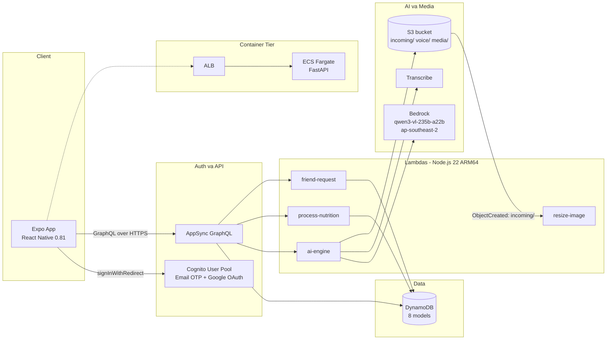

# 4.1 Tổng quan

NutriTrack là nền tảng theo dõi dinh dưỡng tích hợp AI, cấp độ production, xây dựng trên AWS Amplify Gen 2. Workshop này hướng dẫn bạn triển khai đúng backend và mobile client đang có trong `TEMPLATE/neurax-web-app/`, từ đầu đến cuối, trong một ngày làm việc.

## Bạn sẽ xây dựng gì

Sau khi hoàn thành workshop, bạn sẽ có một stack đang chạy gồm:

- **8 model DynamoDB** do AppSync quản lý (`Food`, `user`, `FoodLog`, `FridgeItem`, `Challenge`, `ChallengeParticipant`, `Friendship`, `UserPublicStats`), định nghĩa trong `backend/amplify/data/resource.ts`.
- **4 Lambda function** chạy trên **Node.js 22 / ARM64**:
  - `ai-engine` — handler AI đa hành động, 512 MB, timeout 120 giây.
  - `process-nutrition` — tra cứu dinh dưỡng lai DynamoDB + AI.
  - `friend-request` — mutation cho hệ thống bạn bè.
  - `resize-image` — trigger S3 event trên prefix `incoming/`.
- **10 hành động AI** do Lambda `aiEngine` phục vụ: `analyzeFoodImage`, `generateCoachResponse`, `searchFoodNutrition`, `fixFood`, `voiceToFood`, `ollieCoachTip`, `generateRecipe`, `calculateMacros`, `challengeSummary`, `weeklyInsight`.
- **Amazon Bedrock** với foundation model `qwen.qwen3-vl-235b-a22b` ở **ap-southeast-2** (Sydney), gọi bởi AI coach persona tên **Ollie**.
- **Amazon S3** bucket với các prefix `incoming/`, `voice/`, `media/`, gắn vào `resize-image` qua S3 event notification và lifecycle rule 1 ngày trên `incoming/`.
- **Amazon Cognito** user pool với đăng ký email + OTP và Google federated identity.
- **Amazon Transcribe** cho tính năng voice-to-food, gọi từ `ai-engine` với resource policy cấp quyền trên `voice/*`.
- **ECS Fargate** container tier chạy service FastAPI (`backend/main.py`) sau một Application Load Balancer, triển khai từ `infrastructure/` (Terraform) hoặc `ECS/` (Docker + CI/CD).
- **Ứng dụng Expo** (SDK 54, React Native 0.81, React 19, Expo Router 6, Zustand 5, `@react-three/fiber`) trong `frontend/`.

## Kiến trúc tổng quan

## Kết quả học tập

Sau khi hoàn thành workshop này, bạn sẽ có thể:

1. Khởi tạo một backend Amplify Gen 2 từ đầu và tiến hóa qua ba môi trường (sandbox, `feat/phase3`, `main`).
2. Mô hình hóa một domain multi-tenant thực tế trong Amplify Data với authorization theo owner và GSI.
3. Gắn Lambda Node.js 22 vào AppSync dưới dạng custom query và mutation, đính kèm IAM policy bằng CDK escape hatch.
4. Gọi foundation model đa phương thức trên Amazon Bedrock (Qwen3-VL) từ Lambda, bao gồm đầu vào hình ảnh và giọng nói.
5. Cấu hình S3 event notification, resource policy cho Transcribe, và lifecycle rule trực tiếp trong `backend.ts`.
6. Chạy Expo client với file `amplify_outputs.json` được tự sinh và test trên thiết bị thật qua Expo Go.
7. Gỡ toàn bộ tài nguyên sạch sẽ để hóa đơn AWS trở về 0.

## Ước tính chi phí

Chạy workshop này từ đầu đến cuối trong một ngày ở một region thường rơi vào khoảng **$5 đến $15 USD**. Hai khoản tốn nhất là Bedrock token và ECS Fargate. Nếu để chạy cả tháng với traffic dev nhẹ, dự kiến **$50 đến $150 USD**, vẫn do Bedrock chiếm phần lớn. Xem chi tiết chi phí ở `../4.11-Appendices/` và bật AWS Budgets trước khi bắt đầu.

## Thời lượng và độ khó

- **Thời lượng**: khoảng 1 ngày làm việc (6 đến 8 tiếng) nếu bạn làm tuần tự, không rẽ ngang.
- **Độ khó**: **Trung cấp**. Bạn nên quen TypeScript, AWS Console, và terminal. Kinh nghiệm React Native là một lợi thế nhưng không bắt buộc — frontend chạy nguyên trạng.

## Các phần trong workshop

1. [4.2 Điều kiện tiên quyết](../4.2-Prerequiste/) — tài khoản, công cụ, đăng ký truy cập Bedrock.
2. [4.3 Foundation Setup](../4.3-Foundation-Setup/) — cấu trúc repo, Amplify sandbox, Cognito.
3. [4.4 Monitoring Setup](../4.4-Monitoring-Setup/) — AppSync và các model DynamoDB.
4. [4.5 Processing Setup](../4.5-Processing-Setup/) — Bedrock + Lambda `ai-engine`.
5. [4.6 Automation Setup](../4.6-Automation-Setup/) — S3, trigger resize-image, Transcribe.
6. [4.7 Dashboard Setup](../4.7-Dashboard-Setup/) — cấu hình app Expo.
7. [4.8 Verify Setup](../4.8-Verify-Setup/) — smoke test end-to-end.
8. [4.9 CI/CD — Amplify đa môi trường](../4.9-Use-CDK/) — `amplify.yml`, sandbox → `feat/phase3` → `main`.
9. [4.10 Dọn dẹp](../4.10-Cleanup/) — teardown an toàn.
10. [4.11 Phụ lục](../4.11-Appendices/) — bảng chi phí, troubleshooting, tham khảo.

## Nguồn đối chiếu

Mọi phát biểu trong workshop này đều dựa trên code thực tế dưới `TEMPLATE/neurax-web-app/`. Khi tài liệu và code mâu thuẫn, code là đúng. Các file nên mở sẵn ở tab thứ hai:

- `TEMPLATE/neurax-web-app/backend/amplify/backend.ts`
- `TEMPLATE/neurax-web-app/backend/amplify/data/resource.ts`
- `TEMPLATE/neurax-web-app/backend/amplify/ai-engine/handler.ts`
- `TEMPLATE/neurax-web-app/amplify.yml`
- `TEMPLATE/neurax-web-app/CLAUDE.md`
