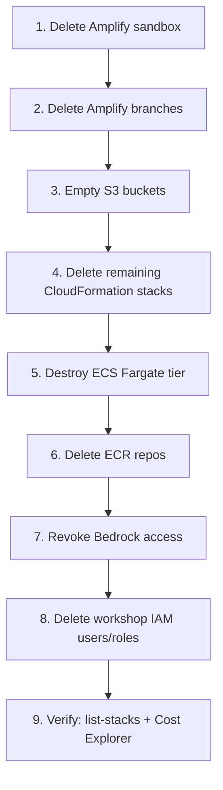

# 4.10 Cleanup

Run this section the same day you finish the workshop. AWS will happily bill you for idle Fargate tasks, Bedrock-enabled NAT traffic, and orphaned ALBs forever if you let it. Follow the steps **in order** — several resources cannot be deleted until their dependents are gone first.

## Order of Operations



## 1. Delete the Amplify Sandbox

From `backend/`:

```bash
cd backend
npx ampx sandbox delete
```

Confirm the prompt. This tears down the CloudFormation stack prefixed `amplify-nutritrack-tdtp2--` along with its Cognito pool, AppSync API, Lambdas, and DynamoDB tables suffixed `tynb5fej6jeppdrgxizfiv4l3m`.

If the command fails because the S3 bucket is not empty, empty it first with step 3 and retry.

## 2. Delete Amplify Branch Environments

Each Amplify Hosting branch is a separate CloudFormation stack. Delete both:

```bash
aws amplify delete-branch --app-id d1glc6vvop0xlb --branch-name feat/phase3
aws amplify delete-branch --app-id d1glc6vvop0xlb --branch-name main
```

Replace `d1glc6vvop0xlb` with your actual Amplify app ID from the Console URL. If you want to keep the app shell, stop here. If you want everything gone, also run:

```bash
aws amplify delete-app --app-id d1glc6vvop0xlb
```


## 3. Empty S3 Buckets Before Deletion

CloudFormation cannot delete a non-empty bucket. Each environment has its own storage bucket with the same four prefixes. Double-check **each** prefix before moving on:

- `incoming/` — raw image uploads (should be nearly empty due to 1-day lifecycle rule).
- `voice/` — voice recordings for Transcribe.
- `media/` — processed images.
- `protected/`, `private/`, `public/` — Amplify Auth-scoped uploads (only present if you tested authenticated uploads).

List buckets:

```bash
aws s3 ls | grep -i nutritrack
```

Empty every matched bucket:

```bash
aws s3 rm s3://BUCKET_NAME --recursive
aws s3 rb s3://BUCKET_NAME
```

Repeat for the sandbox, `feat/phase3`, and `main` buckets.

## 4. Delete Remaining CloudFormation Stacks

If the Amplify delete commands left orphaned stacks (rare, but it happens when a custom resource hangs), list and delete them manually:

```bash
aws cloudformation list-stacks \
  --stack-status-filter CREATE_COMPLETE UPDATE_COMPLETE DELETE_FAILED
```

Any stack whose name contains `amplify-nutritrack`, `amplify-d1glc6vvop0xlb`, or `NutriTrack` is fair game:

```bash
aws cloudformation delete-stack --stack-name STACK_NAME
```

Watch for `DELETE_FAILED` — that usually means a dependency (S3 bucket, ENI, log group) is still pinned. Delete the pinning resource and retry.

## 5. Destroy the ECS Fargate Tier

### Option A — Terraform (recommended if you used `infrastructure/`)

```bash
cd infrastructure
terraform destroy
```

Type `yes` at the confirmation. Terraform tears down the VPC, subnets, ALB, target groups, ECS cluster, service, task definition, and IAM roles in the correct order.

### Option B — AWS Console (if you deployed manually from `ECS/`)

Delete in **this exact order** or you will hit dependency errors:

1. ECS service (scale to 0 tasks first, then delete).
2. ECS task definitions (deregister all revisions).
3. ECS cluster.
4. ALB listeners, then the ALB itself.
5. Target groups.
6. Security groups attached to the ALB and tasks.
7. NAT Gateway (expensive — kill it early if you are in a hurry, but after the tasks are stopped).
8. Elastic IPs released.
9. VPC (only deletable once everything above is gone).

## 6. Delete ECR Repositories

The FastAPI image lives in ECR. List and delete:

```bash
aws ecr describe-repositories --query 'repositories[].repositoryName'
aws ecr delete-repository --repository-name nutritrack-api --force
```

`--force` is required because the repo contains images. Only use it after confirming the repository name.

## 7. Revoke Bedrock Model Access

Bedrock model access by itself has no cost, so revoking is optional. If you want a clean slate:

1. Open **Amazon Bedrock → Model access** in `ap-southeast-2`.
2. Click **Modify model access**.
3. Untick **Qwen 3 VL 235B A22B**.
4. Submit.

## 8. Delete Workshop IAM Users and Roles

If you created a dedicated IAM user for the workshop, delete it:

```bash
aws iam list-access-keys --user-name nutritrack-workshop
aws iam delete-access-key --user-name nutritrack-workshop --access-key-id AKIA...
aws iam detach-user-policy --user-name nutritrack-workshop --policy-arn arn:aws:iam::aws:policy/AdministratorAccess
aws iam delete-user --user-name nutritrack-workshop
```

Amplify and CDK leave behind several service roles. Filter for them:

```bash
aws iam list-roles --query "Roles[?contains(RoleName, 'amplify') || contains(RoleName, 'nutritrack')].RoleName"
```

Delete each one after detaching its policies. Do **not** delete AWS-managed service-linked roles (names starting with `AWSServiceRoleFor...`).

## 9. Verify Everything Is Gone

### Stacks

```bash
aws cloudformation list-stacks \
  --stack-status-filter CREATE_COMPLETE UPDATE_COMPLETE
```

No stack in the output should contain `NutriTrack`, `amplify-nutritrack`, or `amplify-d1glc6vvop0xlb`.

### Cost Explorer

Open **Billing → Cost Explorer**, filter by service for Bedrock, Fargate, DynamoDB, AppSync, and S3. Daily costs should trend to zero within **24 to 48 hours** of the cleanup. If a service is still accruing after 48 hours, something is still running — go back through the list above.

### Billing dashboard screenshot


## What NOT to Delete

The following can be kept safely and reused for other projects:

- **Google Cloud OAuth client** — no ongoing cost, and recreating it means updating every Cognito config that uses it.
- **Your own IAM admin user** — the one you started the workshop with. Only delete the *dedicated* workshop user if you created one.
- **AWS Budgets alerts** — cost nothing, keep protecting you.
- **CloudTrail** — keep for audit history.
- **AWS-managed service-linked roles** — these are shared across services; deleting them breaks unrelated things.
- **Route 53 hosted zones you did not create for this workshop.**

If you are unsure about a resource, leave it. An orphaned IAM role costs nothing. An accidentally deleted production role costs hours of recovery.
