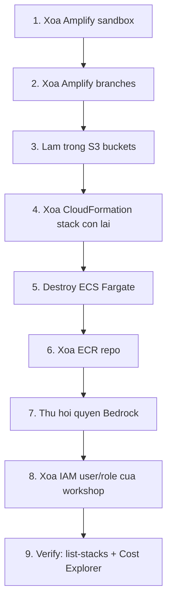

# 4.10 Dọn dẹp

Chạy phần này ngay trong ngày bạn kết thúc workshop. AWS sẽ vui vẻ tính tiền cho Fargate task idle, traffic NAT phục vụ Bedrock, và ALB mồ côi vô thời hạn nếu bạn để mặc. Làm các bước **theo thứ tự** — nhiều tài nguyên không thể xóa cho đến khi các dependent của chúng biến mất trước.

## Thứ tự thao tác



## 1. Xóa Amplify Sandbox

Từ `backend/`:

```bash
cd backend
npx ampx sandbox delete
```

Xác nhận prompt. Lệnh này gỡ CloudFormation stack tiền tố `amplify-nutritrack-tdtp2--` kèm Cognito pool, AppSync API, Lambda, và các bảng DynamoDB hậu tố `tynb5fej6jeppdrgxizfiv4l3m`.

Nếu lệnh fail vì S3 bucket không rỗng, làm trống bucket ở bước 3 trước rồi chạy lại.

## 2. Xóa các môi trường nhánh Amplify

Mỗi branch Amplify Hosting là một CloudFormation stack riêng. Xóa cả hai:

```bash
aws amplify delete-branch --app-id d1glc6vvop0xlb --branch-name feat/phase3
aws amplify delete-branch --app-id d1glc6vvop0xlb --branch-name main
```

Thay `d1glc6vvop0xlb` bằng Amplify app ID thực tế của bạn (lấy từ URL trong Console). Nếu muốn giữ vỏ app, dừng ở đây. Nếu muốn xóa sạch, chạy thêm:

```bash
aws amplify delete-app --app-id d1glc6vvop0xlb
```


## 3. Làm trống S3 bucket trước khi xóa

CloudFormation không xóa được bucket không rỗng. Mỗi môi trường có một bucket riêng với cùng bốn prefix. Kiểm tra **từng** prefix trước khi đi tiếp:

- `incoming/` — ảnh upload thô (thường gần rỗng do lifecycle rule 1 ngày).
- `voice/` — bản ghi âm cho Transcribe.
- `media/` — ảnh đã xử lý.
- `protected/`, `private/`, `public/` — upload theo scope Amplify Auth (chỉ có nếu bạn đã test upload với user đã đăng nhập).

Liệt kê bucket:

```bash
aws s3 ls | grep -i nutritrack
```

Làm trống và xóa từng bucket tìm thấy:

```bash
aws s3 rm s3://BUCKET_NAME --recursive
aws s3 rb s3://BUCKET_NAME
```

Lặp lại cho bucket của sandbox, `feat/phase3`, và `main`.

## 4. Xóa các CloudFormation stack còn sót

Nếu lệnh xóa Amplify để sót stack mồ côi (hiếm, nhưng xảy ra khi một custom resource bị treo), liệt kê và xóa thủ công:

```bash
aws cloudformation list-stacks \
  --stack-status-filter CREATE_COMPLETE UPDATE_COMPLETE DELETE_FAILED
```

Stack nào có tên chứa `amplify-nutritrack`, `amplify-d1glc6vvop0xlb`, hoặc `NutriTrack` đều có thể xóa:

```bash
aws cloudformation delete-stack --stack-name STACK_NAME
```

Chú ý `DELETE_FAILED` — thường là do một dependency (S3 bucket, ENI, log group) vẫn còn ghim. Xóa thứ đang ghim rồi thử lại.

## 5. Destroy ECS Fargate

### Cách A — Terraform (khuyến nghị nếu bạn dùng `infrastructure/`)

```bash
cd infrastructure
terraform destroy
```

Gõ `yes` để xác nhận. Terraform tháo VPC, subnet, ALB, target group, cluster ECS, service, task definition và IAM role theo đúng thứ tự.

### Cách B — AWS Console (nếu bạn deploy tay từ `ECS/`)

Xóa theo **đúng thứ tự sau** nếu không sẽ gặp lỗi dependency:

1. ECS service (scale về 0 task trước, rồi delete).
2. ECS task definition (deregister mọi revision).
3. ECS cluster.
4. ALB listener, rồi đến ALB.
5. Target group.
6. Security group gắn với ALB và task.
7. NAT Gateway (tốn tiền — nên diệt sớm nếu vội, nhưng phải sau khi task đã dừng).
8. Giải phóng Elastic IP.
9. VPC (chỉ xóa được khi mọi thứ ở trên đã biến mất).

## 6. Xóa ECR repository

Image FastAPI nằm ở ECR. Liệt kê và xóa:

```bash
aws ecr describe-repositories --query 'repositories[].repositoryName'
aws ecr delete-repository --repository-name nutritrack-api --force
```

`--force` bắt buộc vì repo có image bên trong. Chỉ dùng sau khi đã xác nhận tên repo.

## 7. Thu hồi quyền Bedrock

Quyền truy cập model Bedrock không phát sinh phí riêng, nên bước này tùy chọn. Nếu muốn sạch hoàn toàn:

1. Mở **Amazon Bedrock → Model access** ở `ap-southeast-2`.
2. Nhấn **Modify model access**.
3. Bỏ tick **Qwen 3 VL 235B A22B**.
4. Submit.

## 8. Xóa IAM user và role của workshop

Nếu bạn tạo một IAM user chuyên cho workshop, xóa nó:

```bash
aws iam list-access-keys --user-name nutritrack-workshop
aws iam delete-access-key --user-name nutritrack-workshop --access-key-id AKIA...
aws iam detach-user-policy --user-name nutritrack-workshop --policy-arn arn:aws:iam::aws:policy/AdministratorAccess
aws iam delete-user --user-name nutritrack-workshop
```

Amplify và CDK để lại một số service role. Lọc ra:

```bash
aws iam list-roles --query "Roles[?contains(RoleName, 'amplify') || contains(RoleName, 'nutritrack')].RoleName"
```

Xóa từng cái sau khi detach policy của nó. **Không** xóa service-linked role do AWS quản lý (tên bắt đầu bằng `AWSServiceRoleFor...`).

## 9. Xác minh mọi thứ đã biến mất

### Stack

```bash
aws cloudformation list-stacks \
  --stack-status-filter CREATE_COMPLETE UPDATE_COMPLETE
```

Kết quả không được chứa stack nào với `NutriTrack`, `amplify-nutritrack`, hay `amplify-d1glc6vvop0xlb`.

### Cost Explorer

Mở **Billing → Cost Explorer**, filter theo service cho Bedrock, Fargate, DynamoDB, AppSync, và S3. Chi phí hằng ngày phải về gần 0 trong vòng **24 đến 48 giờ** sau cleanup. Nếu sau 48 giờ vẫn có service phát sinh chi phí, còn gì đó đang chạy — quay lại rà lại danh sách ở trên.

### Ảnh chụp dashboard billing


## Những thứ KHÔNG nên xóa

Những thứ dưới đây nên giữ lại và tái sử dụng cho project khác:

- **Google Cloud OAuth client** — không tốn phí, và tạo lại sẽ phải cập nhật mọi cấu hình Cognito đang dùng nó.
- **IAM admin user của chính bạn** — cái mà bạn dùng để bắt đầu workshop. Chỉ xóa user *dành riêng* cho workshop nếu bạn có tạo.
- **AWS Budgets alert** — miễn phí, giữ lại để bảo vệ bạn.
- **CloudTrail** — giữ lại cho lịch sử audit.
- **Service-linked role do AWS quản lý** — dùng chung giữa các service; xóa sẽ làm hỏng thứ khác không liên quan.
- **Route 53 hosted zone không phải do workshop này tạo ra.**

Nếu không chắc về một tài nguyên, để nguyên. IAM role mồ côi không tốn tiền. Xóa nhầm role production tốn vài giờ phục hồi.
