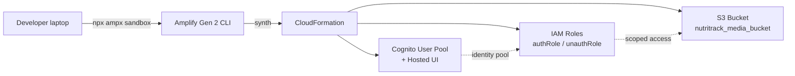

# 4.3 Foundation Setup

This phase provisions the base AWS resources that every later section depends on: the Amplify Gen 2 project skeleton, a Cognito User Pool with email plus Google OAuth, and an S3 bucket partitioned into four prefixes (`incoming/`, `voice/`, `avatar/`, `media/`). Nothing in this phase creates a Lambda, a DynamoDB table, or an AppSync API — those are wired up in phases 4.4 and 4.5. The goal is a deployable sandbox that CloudFormation can reproduce on every developer machine.

At the end of 4.3 you will have three things:

1. A `backend/` directory that runs `npx ampx sandbox` cleanly against your AWS account.
2. A Cognito User Pool that can sign a user up with email + OTP and federate a Google identity through the hosted UI.
3. An S3 bucket named `nutritrack_media_bucket` (with CFN-generated suffix) wired to the four access rules and a one-day lifecycle rule on `incoming/`.

Later phases bolt Lambdas, AppSync, and DynamoDB onto this foundation without touching any of the code written here.

## Architecture for this phase

The Amplify CLI runs TypeScript, synthesizes a CDK app under the hood, and submits one CloudFormation stack per developer (the sandbox stack). The stack name is of the form `amplify-nutritrack-<username>-sandbox-<hash>`.

## Prerequisites

Before starting 4.3, confirm the items in [`../4.2-Prerequiste/`](../4.2-Prerequiste/) are green:

- AWS CLI v2 configured with a profile that has `AdministratorAccess` (sandbox only).
- Node.js 20 LTS or newer. Amplify Gen 2 Lambda runtime is Node.js 22, but the CLI itself runs on your host Node.
- `npm` 10+.
- An AWS account in a region that supports Bedrock Qwen3-VL. This workshop pins everything to `ap-southeast-2` (Sydney).
- A Google Cloud project with the OAuth consent screen configured (we will create the OAuth client in 4.3.2).

## Sub-sections

| Section | Topic | Est. time |
| --- | --- | --- |
| [4.3.1 Amplify Init](4.3.1-Amplify-Init/) | Scaffold `backend/`, install deps, run first sandbox | 30 min |
| [4.3.2 Cognito Auth](4.3.2-Cognito-Auth/) | Email + Google OAuth, callback URLs, OTP flow | 45 min |
| [4.3.3 S3 Storage](4.3.3-S3-Storage/) | Four prefixes, lifecycle escape hatch, upload test | 30 min |

Total time budget: **90 to 120 minutes** on a cold machine, about half that if you already have the AWS CLI signed in.

## What you should see on success

- `backend/amplify_outputs.json` (or `frontend/amplify_outputs.json` if you generated there) containing `auth.user_pool_id`, `storage.bucket_name`, and the Cognito identity pool ID.
- A CloudFormation stack in the `ap-southeast-2` console with status `CREATE_COMPLETE` and roughly 25 to 35 resources.
- `aws s3 ls` showing a bucket whose name starts with `amplify-nutritracktdtp2-...-nutritrackmediabucket...`.

If any of those are missing at the end of 4.3.3, stop and resolve before moving to [`../4.4-Monitoring-Setup/`](../4.4-Monitoring-Setup/) — the data and Lambda phases assume all three exist.
