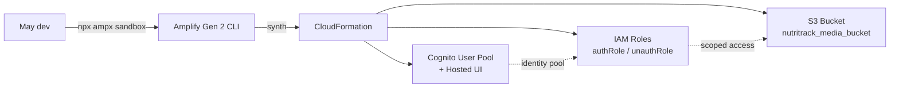

# 4.3 Thiết lập nền tảng

Giai đoạn này cấp phát các tài nguyên AWS nền mà mọi phần sau đều phụ thuộc: khung dự án Amplify Gen 2, một Cognito User Pool hỗ trợ email kèm Google OAuth, và một bucket S3 được chia thành bốn prefix (`incoming/`, `voice/`, `avatar/`, `media/`). Không có Lambda, DynamoDB hay AppSync nào được tạo trong phase này — chúng sẽ được lắp vào ở phase 4.4 và 4.5. Mục tiêu là một sandbox có thể deploy được, và CloudFormation có thể tái tạo nguyên trạng trên mọi máy dev.

Khi kết thúc 4.3 bạn sẽ có ba thứ:

1. Một thư mục `backend/` chạy `npx ampx sandbox` sạch sẽ với tài khoản AWS của bạn.
2. Một Cognito User Pool có thể đăng ký user bằng email + OTP và liên kết danh tính Google qua hosted UI.
3. Một bucket S3 tên `nutritrack_media_bucket` (kèm hậu tố do CFN sinh) đã gắn bốn access rule và lifecycle rule một ngày cho `incoming/`.

Các phase sau sẽ gắn Lambda, AppSync, DynamoDB lên nền tảng này mà không sửa lại bất kỳ dòng code nào viết trong 4.3.

## Kiến trúc của phase này

Amplify CLI chạy TypeScript, bên dưới synth thành một CDK app, và submit một CloudFormation stack cho mỗi dev (stack sandbox). Tên stack có dạng `amplify-nutritrack-<username>-sandbox-<hash>`.

## Điều kiện tiên quyết

Trước khi bắt đầu 4.3, hãy xác nhận các mục trong [`../4.2-Prerequiste/`](../4.2-Prerequiste/) đều đã xong:

- AWS CLI v2 đã cấu hình profile có quyền `AdministratorAccess` (chỉ sandbox).
- Node.js 20 LTS trở lên. Lambda runtime của Amplify Gen 2 là Node.js 22, nhưng bản thân CLI chạy trên Node của máy bạn.
- `npm` 10+.
- Một AWS account ở region hỗ trợ Bedrock Qwen3-VL. Workshop này ghim toàn bộ về `ap-southeast-2` (Sydney).
- Một Google Cloud project đã cấu hình OAuth consent screen (OAuth client sẽ tạo ở 4.3.2).

## Các mục con

| Mục | Nội dung | Thời gian |
| --- | --- | --- |
| [4.3.1 Amplify Init](4.3.1-Amplify-Init/) | Tạo `backend/`, cài dependencies, chạy sandbox lần đầu | 30 phút |
| [4.3.2 Cognito Auth](4.3.2-Cognito-Auth/) | Email + Google OAuth, callback URL, luồng OTP | 45 phút |
| [4.3.3 S3 Storage](4.3.3-S3-Storage/) | Bốn prefix, lifecycle escape hatch, test upload | 30 phút |

Tổng thời gian dự kiến: **90 đến 120 phút** trên máy mới, khoảng một nửa nếu AWS CLI đã đăng nhập sẵn.

## Bạn sẽ thấy gì khi thành công

- `backend/amplify_outputs.json` (hoặc `frontend/amplify_outputs.json` nếu bạn generate sang đó) chứa `auth.user_pool_id`, `storage.bucket_name`, và identity pool ID.
- Một CloudFormation stack trong console `ap-southeast-2` với status `CREATE_COMPLETE` và khoảng 25 đến 35 resource.
- `aws s3 ls` hiển thị một bucket có tên bắt đầu bằng `amplify-nutritracktdtp2-...-nutritrackmediabucket...`.

Nếu thiếu bất kỳ mục nào khi hoàn thành 4.3.3, hãy dừng lại và xử lý trước khi sang [`../4.4-Monitoring-Setup/`](../4.4-Monitoring-Setup/) — các phase data và Lambda đều giả định cả ba đã tồn tại.
