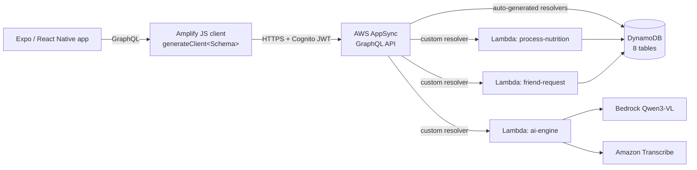

# 4.4 Data Layer — AppSync & DynamoDB

This section defines the persistence and API layer for NutriTrack. Amplify Gen 2's `defineData` compiles a single GraphQL schema into an AWS AppSync API backed by DynamoDB tables, with owner-based authorization inferred directly from the schema. No resolvers are written by hand for standard CRUD — Amplify generates them from the model declarations.

## What gets provisioned

From a single `amplify/data/resource.ts` file, Amplify Gen 2 produces:

- **1 AppSync GraphQL API** (Cognito User Pool auth mode).
- **8 DynamoDB tables**, one per `a.model(...)` declaration.
- **Secondary indexes** (GSIs) declared via `.secondaryIndexes(...)`.
- **Auto-generated CRUD resolvers** for every model (`list`, `get`, `create`, `update`, `delete`).
- **Real-time subscriptions** (`onCreate`, `onUpdate`, `onDelete`) for every model.
- **3 custom Lambda-backed resolvers** (`aiEngine`, `processNutrition`, `friendRequest`).
- **IAM roles** wiring AppSync to DynamoDB and AppSync to Lambda.

## Architecture

## The 8 models at a glance

| Model | Purpose | Auth | GSIs |
| --- | --- | --- | --- |
| `Food` | ~200 Vietnamese nutrition items (shared catalog) | guest read, authenticated read | — |
| `user` | Profile, biometrics, goals, dietary prefs, gamification | owner | `friend_code` |
| `FoodLog` | Meal history (one row per logged food) | owner | `date` |
| `FridgeItem` | Kitchen inventory per user | owner | — |
| `Challenge` | Group challenge definitions | authenticated | — |
| `ChallengeParticipant` | Join rows: users to challenges | authenticated | `user_id` |
| `Friendship` | Bidirectional friend relations | owner | `friend_id` |
| `UserPublicStats` | Leaderboard view (owner write, authenticated read) | mixed | — |

Alongside models, the schema defines **12 `customType` blocks** (`Portions`, `Serving`, `Micronutrients`, `Macros`, `LogMacros`, `LogIngredient`, `biometric`, `goal`, `dietary_profile`, `gamification`, `ai_preferences`) that are embedded inside parent items — they do not produce their own tables.

## Sub-pages

- [4.4.1 AppSync — GraphQL schema, resolvers, auth modes](4.4.1-AppSync/)
- [4.4.2 DynamoDB — tables, indexes, item shapes, seeding](4.4.2-DynamoDB/)

Next section: [4.5 Compute & AI — Lambda functions and Bedrock](../4.5-Processing-Setup/).
