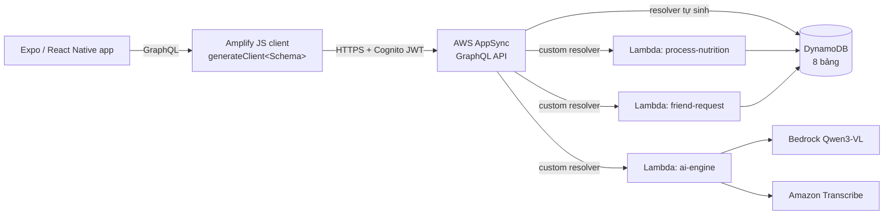

# 4.4 Tầng Dữ liệu — AppSync & DynamoDB

Phần này định nghĩa tầng lưu trữ và API của NutriTrack. `defineData` của Amplify Gen 2 biên dịch một schema GraphQL duy nhất thành AWS AppSync API được hậu thuẫn bởi các bảng DynamoDB, với cơ chế phân quyền owner-based suy ra trực tiếp từ schema. Không cần viết tay resolver cho CRUD tiêu chuẩn — Amplify sinh ra từ khai báo model.

## Những gì được provision

Từ một file `amplify/data/resource.ts` duy nhất, Amplify Gen 2 tạo ra:

- **1 AppSync GraphQL API** (chế độ auth Cognito User Pool).
- **8 bảng DynamoDB**, mỗi bảng tương ứng một `a.model(...)`.
- **Secondary indexes** (GSI) khai báo qua `.secondaryIndexes(...)`.
- **CRUD resolver tự sinh** cho mỗi model (`list`, `get`, `create`, `update`, `delete`).
- **Real-time subscriptions** (`onCreate`, `onUpdate`, `onDelete`) cho mọi model.
- **3 custom resolver Lambda** (`aiEngine`, `processNutrition`, `friendRequest`).
- **IAM role** kết nối AppSync đến DynamoDB và AppSync đến Lambda.

## Kiến trúc

## Tổng quan 8 model

| Model | Mục đích | Auth | GSI |
| --- | --- | --- | --- |
| `Food` | ~200 món Việt (catalog dùng chung) | guest read, authenticated read | — |
| `user` | Profile, biometrics, goal, dietary, gamification | owner | `friend_code` |
| `FoodLog` | Lịch sử bữa ăn (1 row/món đã log) | owner | `date` |
| `FridgeItem` | Tồn kho tủ lạnh của từng user | owner | — |
| `Challenge` | Định nghĩa thử thách nhóm | authenticated | — |
| `ChallengeParticipant` | Bảng join user với challenge | authenticated | `user_id` |
| `Friendship` | Quan hệ bạn bè hai chiều | owner | `friend_id` |
| `UserPublicStats` | View leaderboard (owner ghi, authenticated đọc) | mixed | — |

Ngoài model, schema còn có **12 khối `customType`** (`Portions`, `Serving`, `Micronutrients`, `Macros`, `LogMacros`, `LogIngredient`, `biometric`, `goal`, `dietary_profile`, `gamification`, `ai_preferences`) được nhúng bên trong item cha — chúng không tạo bảng riêng.

## Trang con

- [4.4.1 AppSync — GraphQL schema, resolver, auth mode](4.4.1-AppSync/)
- [4.4.2 DynamoDB — bảng, index, cấu trúc item, seeding](4.4.2-DynamoDB/)

Phần kế tiếp: [4.5 Compute & AI — Lambda và Bedrock](../4.5-Processing-Setup/).
