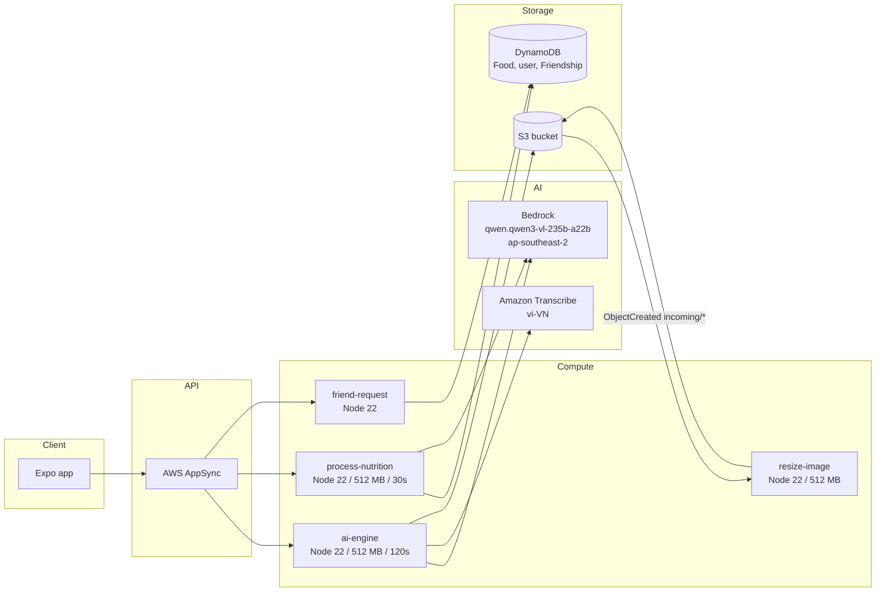

# 4.5 Compute & AI — Lambda và Bedrock

Phần này nói về tầng compute của NutriTrack: bốn Lambda function cộng Amazon Bedrock. Kết hợp lại, chúng biến tấm ảnh tô phở thành một bản ghi nutrition có cấu trúc, trả lời câu hỏi coaching tiếng Việt, và giữ bucket ảnh gọn gàng.

## Bốn Lambda

Cả bốn nằm dưới `backend/amplify/*` và được đăng ký trong `defineBackend` ở `backend.ts`. Tất cả chạy **Node.js 22 trên ARM64** — không ngoại lệ.

| Function | Entry | Memory | Timeout | Resource group | Trigger |
| --- | --- | --- | --- | --- | --- |
| `ai-engine` | `ai-engine/handler.ts` | 512 MB | 120 s | (mặc định) | AppSync query `aiEngine` |
| `process-nutrition` | `process-nutrition/handler.ts` | 512 MB | 30 s | `data` | AppSync query `processNutrition` |
| `friend-request` | `friend-request/handler.ts` | (mặc định) | (mặc định) | (mặc định) | AppSync mutation `friendRequest` |
| `resize-image` | `resize-image/handler.ts` | 512 MB | (mặc định) | `storage` | S3 `ObjectCreated` trên `incoming/` |

`resourceGroupName` rất quan trọng: nó cho Amplify biết Lambda thuộc stack CloudFormation nào. `storage` = cùng stack với S3 bucket (tránh circular dep), `data` = cùng stack với bảng DynamoDB. `friend-request` và `ai-engine` nằm ở stack gốc.

Timeout 120 giây của `ai-engine` là bắt buộc vì `voiceToFood` khởi động một job Amazon Transcribe và poll — Transcribe có thể mất 30-60 giây end-to-end trước khi Bedrock được gọi.

## Kiến trúc

## Model Bedrock chuẩn

Mọi lời gọi Bedrock trong NutriTrack nhắm đúng một model:

- **Model ID**: `qwen.qwen3-vl-235b-a22b`
- **Region**: `ap-southeast-2` (Sydney)
- **API gọi**: `InvokeModelCommand` từ `@aws-sdk/client-bedrock-runtime`
- **Schema**: chat-completions kiểu OpenAI (`messages[]` với `role` và `content`, hỗ trợ `type: 'text'` và `type: 'image_url'`)

Model này đa phương thức (vision + text), xử lý tiếng Việt tốt từ gốc, và chi phí chỉ bằng một phần nhỏ Claude 3.5 Sonnet cho workload này. Lý do lựa chọn được bàn ở 4.5.1.

> Bất kỳ doc cũ nào hay comment cũ còn đề cập `anthropic.claude-3-haiku-...` đều sai — production đang chạy Qwen3-VL.

## AI coach persona: Ollie

Mỗi system prompt trong `ai-engine/handler.ts` đều bắt đầu bằng `You are Ollie...`. Ollie là persona thương hiệu của NutriTrack: coach dinh dưỡng Gen-Z Việt Nam, giọng điệu casual, mặc định trả lời bằng tiếng Việt. Không đổi tên thành "Bảo" hay tên khác — frontend, analytics, prompt library đều phụ thuộc vào "Ollie".

## Trang con

- [4.5.1 Bedrock — model access, pricing, IAM, cấu trúc invoke](4.5.1-Bedrock/)
- [4.5.2 AIEngine — Lambda orchestrator 10 action](4.5.2-AIEngine/)
- [4.5.3 ProcessNutrition — hybrid DB + Bedrock fuzzy lookup](4.5.3-ProcessNutrition/)
- [4.5.4 ResizeImage — resize ảnh bằng sharp, trigger từ S3](4.5.4-ResizeImage/)

Kế tiếp: [4.6 Automation Setup](../4.6-Automation-Setup/).
