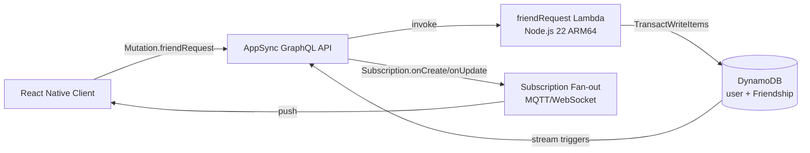

# 4.6 API & Social

This phase wires the custom application logic on top of the Amplify Data layer. Phase 4.5 gave NutriTrack the food and user models; phase 4.6 turns those models into a social product — friend requests, leaderboards, and live updates across devices.

Two things get built here:

1. A custom GraphQL mutation (`friendRequest`) backed by a Lambda function that performs **atomic, bidirectional writes** to the `Friendship` table.
2. Real-time subscriptions on the Amplify models that are already defined, so every logged meal and accepted friend request fans out to every subscribed client within milliseconds.

## Why a custom Lambda for friend requests

A friendship is two rows in DynamoDB — one for each user — so both rows must be written or neither. Amplify's auto-generated resolvers only touch a single row per mutation. A custom Lambda gives us:

- `TransactWriteItems` across the pair of rows (all-or-nothing).
- Business rules that can't live in a resolver: pending-request limit (20), self-friending rejection, duplicate detection.
- A single `friendRequest` entry point that dispatches to five actions (`sendRequest`, `acceptRequest`, `declineRequest`, `removeFriend`, `blockFriend`) — easier to evolve than five separate mutations.

## Why subscriptions are free here

Every `a.model(...)` in `data/resource.ts` automatically exposes `onCreate`, `onUpdate`, `onDelete` subscriptions over AppSync. The frontend just imports the typed client and calls `.subscribe()`. No extra backend code is required — AppSync manages the MQTT-over-WebSocket connection, server-side filtering, and fan-out to subscribed clients.

## Architecture

- Mutations travel HTTPS → AppSync → Lambda → DynamoDB.
- Subscriptions travel back over a persistent WebSocket — AppSync notices the `Friendship` row flipping from `pending` to `accepted` and pushes the updated object to every client that has an active filter matching the row's `owner`.

## Data model recap

From `backend/amplify/data/resource.ts`:

- `user` — `user_id` identifier, `friend_code` secondary index (6-char alphanumeric used for lookup), owner auth.
- `Friendship` — `friend_id` + `friend_code` + `friend_name` + `friend_avatar` + `status` (`pending`/`accepted`/`blocked`) + `direction` (`sent`/`received`) + `linked_id`. Secondary index on `friend_id`. Owner auth.
- `UserPublicStats` — readable by any authenticated user (for leaderboards), writable only by the owner.
- `friendRequest` — custom `a.mutation()` routed to the Lambda handler.

The `linked_id` field is the critical piece: each row stores the UUID of its mirror row so the Lambda can update or delete both rows from either side without a secondary lookup.

## What's in this section

- [4.6.1 — FriendRequest Lambda](4.6.1-FriendRequest/) — custom resolver, env-var injection via CDK escape hatch, the five actions, IAM.
- [4.6.2 — Realtime Subscriptions](4.6.2-Realtime-Subscriptions/) — AppSync subscriptions, which flows use them, cost and scoping.

## Prerequisites

- Phase 4.5 complete — `user`, `Friendship`, `UserPublicStats`, `FoodLog` models deployed.
- `npx ampx sandbox` running with the `data` resource group healthy.
- IAM user with permissions to update Lambda and AppSync resources.

## Deliverables at the end of 4.6

- `friendRequest` mutation callable from the mobile client with all five actions working.
- A client subscription test (two simulator instances) showing a `FoodLog` created on device A appearing on device B within ~1 second.
- CloudWatch logs from the `friend-request` Lambda showing successful `TransactWriteCommand` executions.
