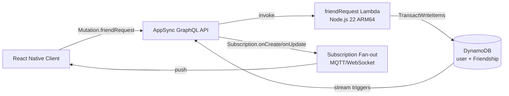

# 4.6 API & Social

Giai đoạn này ráp phần logic ứng dụng tùy chỉnh lên trên lớp Amplify Data. Giai đoạn 4.5 đã cung cấp cho NutriTrack các model food và user; giai đoạn 4.6 biến chúng thành một sản phẩm mang tính xã hội — lời mời kết bạn, bảng xếp hạng và cập nhật trực tiếp giữa các thiết bị.

Hai thứ được xây ở đây:

1. Một GraphQL mutation tùy chỉnh (`friendRequest`) chạy bằng Lambda, thực hiện **ghi hai hàng đồng thời và có tính nguyên tử** vào bảng `Friendship`.
2. Real-time subscriptions trên các Amplify model đã định nghĩa, để mỗi bữa ăn được log và mỗi lời mời được chấp nhận tự đẩy ra toàn bộ client đang kết nối trong vài trăm mili-giây.

## Vì sao cần Lambda tùy chỉnh cho friend request

Một quan hệ bạn bè gồm hai hàng trong DynamoDB — một cho mỗi phía — nên hoặc cả hai được ghi, hoặc không hàng nào được ghi. Resolver tự sinh của Amplify chỉ chạm một hàng mỗi mutation. Lambda tùy chỉnh cho phép:

- `TransactWriteItems` trên cả cặp hàng (all-or-nothing).
- Quy tắc nghiệp vụ không thể viết trong resolver: giới hạn 20 lời mời đang chờ, chặn tự kết bạn, phát hiện trùng lặp.
- Một điểm vào `friendRequest` duy nhất dispatch tới năm action (`sendRequest`, `acceptRequest`, `declineRequest`, `removeFriend`, `blockFriend`) — dễ phát triển hơn năm mutation riêng biệt.

## Vì sao subscriptions là "miễn phí" ở đây

Mỗi `a.model(...)` trong `data/resource.ts` tự động phơi bày ba subscription `onCreate`, `onUpdate`, `onDelete` qua AppSync. Frontend chỉ cần import typed client và gọi `.subscribe()`. Không cần code backend gì thêm — AppSync tự quản lý kết nối MQTT-over-WebSocket, lọc phía server và fan-out tới các client đang đăng ký.

## Kiến trúc

- Mutation đi HTTPS → AppSync → Lambda → DynamoDB.
- Subscription đi ngược lại qua WebSocket bền vững — AppSync phát hiện hàng `Friendship` chuyển từ `pending` sang `accepted` và đẩy object mới tới mọi client có filter khớp `owner`.

## Tóm tắt data model

Từ `backend/amplify/data/resource.ts`:

- `user` — identifier `user_id`, secondary index `friend_code` (mã 6 ký tự alphanumeric dùng để tra cứu), auth theo owner.
- `Friendship` — `friend_id` + `friend_code` + `friend_name` + `friend_avatar` + `status` (`pending`/`accepted`/`blocked`) + `direction` (`sent`/`received`) + `linked_id`. Secondary index trên `friend_id`. Auth theo owner.
- `UserPublicStats` — bất kỳ user đã đăng nhập nào cũng đọc được (dùng cho leaderboard), chỉ owner được ghi.
- `friendRequest` — `a.mutation()` tùy chỉnh được route vào Lambda handler.

Trường `linked_id` là mảnh ghép quan trọng: mỗi hàng lưu UUID của hàng đối xứng, nhờ đó Lambda có thể update hoặc delete cả hai hàng từ bất kỳ phía nào mà không cần truy vấn phụ.

## Nội dung trong mục này

- [4.6.1 — FriendRequest Lambda](4.6.1-FriendRequest/) — custom resolver, inject env var qua CDK escape hatch, năm action, IAM.
- [4.6.2 — Realtime Subscriptions](4.6.2-Realtime-Subscriptions/) — subscription của AppSync, các flow dùng, chi phí và cách giới hạn phạm vi.

## Điều kiện tiên quyết

- Giai đoạn 4.5 đã hoàn tất — các model `user`, `Friendship`, `UserPublicStats`, `FoodLog` đã được triển khai.
- `npx ampx sandbox` đang chạy, resource group `data` khỏe.
- IAM user có quyền cập nhật tài nguyên Lambda và AppSync.

## Đầu ra khi kết thúc 4.6

- Mutation `friendRequest` gọi được từ mobile client, đủ cả năm action.
- Thử nghiệm subscription (hai simulator cùng lúc) cho thấy một `FoodLog` tạo trên thiết bị A xuất hiện trên thiết bị B trong khoảng 1 giây.
- CloudWatch log của Lambda `friend-request` cho thấy các lệnh `TransactWriteCommand` thành công.
