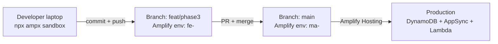

# 4.9 CI/CD — Amplify Multi-Environment

This phase wires the backend into Amplify Hosting's managed CI/CD and walks through the three environments NutriTrack ships with. There is no hand-written CDK or CodePipeline here — Amplify Gen 2 deploys directly from Git using `amplify.yml`.

## The Three Environments

NutriTrack runs three parallel Amplify backends. Each one has its own Cognito pool, AppSync API, DynamoDB tables, Lambda functions, and S3 bucket. The exact names come from the real deployment recorded in `TEMPLATE/neurax-web-app/CLAUDE.md`.

| Environment            | Trigger                            | Lambda name prefix           | DynamoDB table suffix        |
| ---------------------- | ---------------------------------- | ---------------------------- | ---------------------------- |
| **Sandbox** (local)    | `npx ampx sandbox` from `backend/` | `amplify-nutritrack-tdtp2--` | `tynb5fej6jeppdrgxizfiv4l3m` |
| **Branch feat/phase3** | `git push origin feat/phase3`      | `amplify-d1glc6vvop0xlb-fe-` | `vic4ri35gbfpvnw5nw3lkyapki` |
| **Branch main**        | `git push origin main`             | `amplify-d1glc6vvop0xlb-ma-` | `2c73cq2usbfgvp7eaihsupyjwe` |

Every DynamoDB model (`Food`, `user`, `FoodLog`, …) exists three times, once per environment. A `FoodLog` row in sandbox is invisible to `main` and vice versa. This is the whole point — you can blow up sandbox without touching production.

### Why three?

- **Sandbox** is ephemeral, per-developer, and destroyed with `npx ampx sandbox delete`. Use it for iteration.
- **`feat/phase3`** is the shared integration environment. QA and mentors point the mobile app at this backend.
- **`main`** is production. Only merged, reviewed code lands here.

## The `amplify.yml` Build Spec

Amplify Hosting reads `amplify.yml` at the repo root. The real file ships at `TEMPLATE/neurax-web-app/amplify.yml`:

```yaml
version: 1
backend:
  phases:
    build:
      commands:
        - cd backend
        - npm install --legacy-peer-deps --include=dev

        - cd amplify/ai-engine
        - npm install --include=dev
        - cd ../..

        - cd amplify/process-nutrition
        - npm install --include=dev
        - cd ../..

        - cd amplify/friend-request
        - npm install --include=dev
        - cd ../..

        - cd amplify/resize-image
        - npm install --include=dev
        - cd ../..

        - npx ampx pipeline-deploy --branch $AWS_BRANCH --app-id $AWS_APP_ID --outputs-out-dir ../frontend
        - cd ..
frontend:
  phases:
    preBuild:
      commands:
        - cd frontend && npm install --legacy-peer-deps && cd ..
    build:
      commands:
        - cd frontend && npm run build
  artifacts:
    baseDirectory: frontend/dist
    files:
      - "**/*"
  cache:
    paths:
      - frontend/node_modules/**/*
      - frontend/.expo/**/*
      - backend/node_modules/**/*
      - backend/amplify/ai-engine/node_modules/**/*
      - backend/amplify/process-nutrition/node_modules/**/*
      - backend/amplify/friend-request/node_modules/**/*
      - backend/amplify/resize-image/node_modules/**/*
```

### Key things to notice

1. **Every Lambda subfolder has its own `package.json`.** The build spec enters each one and runs `npm install --include=dev` before the Amplify CLI bundles the function. If you add a fifth Lambda, you must add its `cd / npm install / cd ../..` block here, or the build will fail with "Cannot find module" at deploy time.
2. **`--legacy-peer-deps` is mandatory** for both `backend/` and `frontend/`. Expo SDK 54 + React 19 + `@react-three/fiber` produces peer-dep conflicts that the default resolver rejects. This is enforced for the frontend in `frontend/.npmrc`.
3. **`npx ampx pipeline-deploy`** is the Gen 2 CI command. It reads `$AWS_BRANCH` and `$AWS_APP_ID` (injected by Amplify Hosting) and deploys the `backend/amplify/` CDK app into the environment's CloudFormation stack.
4. **`--outputs-out-dir ../frontend`** writes `amplify_outputs.json` next to the Expo app. The frontend build step then picks it up — no manual step required.
5. **`cache.paths`** keeps all seven `node_modules/` warm between builds. The first build of a branch is slow; subsequent builds are minutes, not tens of minutes.

## `amplify_outputs.json` — Never Commit Manual Edits

The Amplify CLI generates `frontend/amplify_outputs.json` on every deploy. It contains environment-specific ARNs, endpoints, and user pool IDs. You must:

- **Never hand-edit the file.** Your change will be wiped on the next `pipeline-deploy` or `npx ampx generate outputs`.
- **Never commit a sandbox version of it to `main`.** That would point the `main` frontend at sandbox resources.
- **Regenerate locally after backend changes** from `backend/`:

```bash
cd backend
npx ampx generate outputs --outputs-out-dir ../frontend
```

If you need environment-specific files committed (rare), use `.gitignore` to exclude `amplify_outputs.json` and have each developer generate their own.

## Sandbox Secrets

Secrets referenced by `backend.ts` — Google OAuth is the common one — are set per environment. For sandbox:

```bash
cd backend
npx ampx sandbox secret set GOOGLE_CLIENT_ID
npx ampx sandbox secret set GOOGLE_CLIENT_SECRET
```

For branch environments, go to **Amplify Console → your app → Hosting → Secrets** and set `GOOGLE_CLIENT_ID` / `GOOGLE_CLIENT_SECRET` against the branch. Amplify injects them at deploy time; they are not stored in the repo.

List what sandbox currently has:

```bash
cd backend
npx ampx sandbox secret list
```

## Promotion Flow

The promotion path is strictly linear: sandbox → `feat/phase3` → `main`.



### Day-to-day loop

```bash
cd backend
npx ampx sandbox
```

Make changes. The sandbox watcher re-deploys on save. Run the Expo app locally against the sandbox `amplify_outputs.json`.

When the feature is stable:

```bash
git checkout feat/phase3
git merge my-feature-branch
git push origin feat/phase3
```

Amplify Hosting picks up the push and runs `amplify.yml` against the `feat/phase3` environment. Watch the build in **Amplify Console → your app → feat/phase3**.

When QA signs off:

```bash
git checkout main
git merge feat/phase3
git push origin main
```

Same flow, different environment. The `main` deploy uses the tables suffixed `2c73cq2usbfgvp7eaihsupyjwe`.


## Verifying a Deploy

After a successful build:

1. Amplify Console shows **Provision → Build → Deploy → Verify** all green.
2. CloudFormation stacks in the region contain the new resources. Check with the command below.
3. Lambda function names for the branch should match the prefix in the table at the top of this page.
4. Run a smoke test against AppSync from the mobile client to confirm tokens issued by the new Cognito pool work.

```bash
aws cloudformation list-stacks \
  --stack-status-filter CREATE_COMPLETE UPDATE_COMPLETE
```

If a deploy fails, read the Amplify Console log top-to-bottom. The most common failures are (a) missing `npm install` for a new Lambda folder and (b) Bedrock model access not granted in `ap-southeast-2` — the IAM policy in `backend.ts` will deploy, but runtime calls will fail with `AccessDeniedException`.

## Rollback

Amplify Hosting does not roll back CloudFormation stacks automatically across branches. To roll back `main`:

```bash
git revert <bad-commit-sha>
git push origin main
```

That triggers a fresh `pipeline-deploy` that brings the stack back to the previous state. DynamoDB data is not reverted — if the bad deploy wrote corrupt rows, you must fix them directly in DynamoDB.
