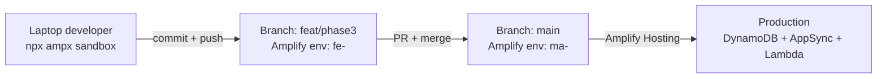

# 4.9 CI/CD — Amplify đa môi trường

Giai đoạn này cắm backend vào CI/CD quản lý của Amplify Hosting và đi qua ba môi trường mà NutriTrack sử dụng. Không có CDK viết tay hay CodePipeline nào ở đây — Amplify Gen 2 deploy thẳng từ Git thông qua `amplify.yml`.

## Ba môi trường

NutriTrack chạy ba backend Amplify song song. Mỗi môi trường có Cognito pool, AppSync API, bảng DynamoDB, Lambda function và S3 bucket riêng. Tên chính xác lấy từ deployment thật được ghi lại trong `TEMPLATE/neurax-web-app/CLAUDE.md`.

| Môi trường             | Kích hoạt                          | Tiền tố tên Lambda           | Hậu tố tên bảng DynamoDB     |
| ---------------------- | ---------------------------------- | ---------------------------- | ---------------------------- |
| **Sandbox** (local)    | `npx ampx sandbox` từ `backend/`   | `amplify-nutritrack-tdtp2--` | `tynb5fej6jeppdrgxizfiv4l3m` |
| **Branch feat/phase3** | `git push origin feat/phase3`      | `amplify-d1glc6vvop0xlb-fe-` | `vic4ri35gbfpvnw5nw3lkyapki` |
| **Branch main**        | `git push origin main`             | `amplify-d1glc6vvop0xlb-ma-` | `2c73cq2usbfgvp7eaihsupyjwe` |

Mỗi model DynamoDB (`Food`, `user`, `FoodLog`, …) tồn tại ba lần, mỗi môi trường một bản. Một dòng `FoodLog` ở sandbox không nhìn thấy được từ `main` và ngược lại. Đây chính là mục đích — bạn có thể làm tan nát sandbox mà không đụng tới production.

### Tại sao cần ba?

- **Sandbox** là tạm thời, theo từng developer, xóa bằng `npx ampx sandbox delete`. Dùng để lặp nhanh.
- **`feat/phase3`** là môi trường tích hợp dùng chung. QA và mentor trỏ mobile app vào backend này.
- **`main`** là production. Chỉ code đã merge và review mới vào đây.

## File `amplify.yml`

Amplify Hosting đọc `amplify.yml` ở gốc repo. File thật nằm tại `TEMPLATE/neurax-web-app/amplify.yml`:

```yaml
version: 1
backend:
  phases:
    build:
      commands:
        - cd backend
        - npm install --legacy-peer-deps --include=dev

        - cd amplify/ai-engine
        - npm install --include=dev
        - cd ../..

        - cd amplify/process-nutrition
        - npm install --include=dev
        - cd ../..

        - cd amplify/friend-request
        - npm install --include=dev
        - cd ../..

        - cd amplify/resize-image
        - npm install --include=dev
        - cd ../..

        - npx ampx pipeline-deploy --branch $AWS_BRANCH --app-id $AWS_APP_ID --outputs-out-dir ../frontend
        - cd ..
frontend:
  phases:
    preBuild:
      commands:
        - cd frontend && npm install --legacy-peer-deps && cd ..
    build:
      commands:
        - cd frontend && npm run build
  artifacts:
    baseDirectory: frontend/dist
    files:
      - "**/*"
  cache:
    paths:
      - frontend/node_modules/**/*
      - frontend/.expo/**/*
      - backend/node_modules/**/*
      - backend/amplify/ai-engine/node_modules/**/*
      - backend/amplify/process-nutrition/node_modules/**/*
      - backend/amplify/friend-request/node_modules/**/*
      - backend/amplify/resize-image/node_modules/**/*
```

### Những điểm quan trọng cần chú ý

1. **Mỗi Lambda subfolder có `package.json` riêng.** Build spec đi vào từng thư mục và chạy `npm install --include=dev` trước khi Amplify CLI đóng gói function. Nếu bạn thêm Lambda thứ năm, phải thêm khối `cd / npm install / cd ../..` tương ứng ở đây, nếu không build sẽ lỗi "Cannot find module" lúc deploy.
2. **`--legacy-peer-deps` là bắt buộc** cho cả `backend/` và `frontend/`. Expo SDK 54 + React 19 + `@react-three/fiber` tạo ra xung đột peer-dep mà resolver mặc định từ chối. Ràng buộc này được enforce trong `frontend/.npmrc`.
3. **`npx ampx pipeline-deploy`** là lệnh CI của Gen 2. Nó đọc `$AWS_BRANCH` và `$AWS_APP_ID` (Amplify Hosting inject) và deploy CDK app trong `backend/amplify/` vào CloudFormation stack của môi trường.
4. **`--outputs-out-dir ../frontend`** ghi `amplify_outputs.json` ngay cạnh app Expo. Bước build frontend sau đó tự pick lên — không cần thao tác tay.
5. **`cache.paths`** giữ ấm cả bảy `node_modules/` giữa các lần build. Lần build đầu của một branch chậm; các lần sau chỉ tính bằng phút, không phải hàng chục phút.

## `amplify_outputs.json` — không bao giờ commit sửa tay

Amplify CLI sinh `frontend/amplify_outputs.json` mỗi lần deploy. File này chứa ARN, endpoint, và user pool ID theo từng môi trường. Bạn phải:

- **Không bao giờ chỉnh tay.** Thay đổi của bạn sẽ bị ghi đè ở lần `pipeline-deploy` hoặc `npx ampx generate outputs` tiếp theo.
- **Không commit bản sandbox vào `main`.** Như vậy sẽ khiến frontend `main` trỏ vào tài nguyên sandbox.
- **Sinh lại local sau khi đổi backend** (chạy trong `backend/`):

```bash
cd backend
npx ampx generate outputs --outputs-out-dir ../frontend
```

Nếu cần commit file riêng cho từng môi trường (hiếm), dùng `.gitignore` để loại `amplify_outputs.json` và để mỗi developer tự sinh bản của mình.

## Sandbox secret

Các secret mà `backend.ts` tham chiếu — Google OAuth là ví dụ phổ biến — được set theo từng môi trường. Với sandbox:

```bash
cd backend
npx ampx sandbox secret set GOOGLE_CLIENT_ID
npx ampx sandbox secret set GOOGLE_CLIENT_SECRET
```

Với branch, vào **Amplify Console → app của bạn → Hosting → Secrets** và set `GOOGLE_CLIENT_ID` / `GOOGLE_CLIENT_SECRET` theo branch. Amplify inject vào lúc deploy; không lưu trong repo.

Liệt kê secret hiện có trong sandbox:

```bash
cd backend
npx ampx sandbox secret list
```

## Luồng promotion

Đường promotion cứng theo thứ tự: sandbox → `feat/phase3` → `main`.



### Vòng lặp hằng ngày

```bash
cd backend
npx ampx sandbox
```

Chỉnh code. Watcher sandbox tự deploy lại khi save. Chạy Expo app local trỏ vào `amplify_outputs.json` của sandbox.

Khi tính năng đã ổn định:

```bash
git checkout feat/phase3
git merge my-feature-branch
git push origin feat/phase3
```

Amplify Hosting nhận push và chạy `amplify.yml` cho môi trường `feat/phase3`. Xem build chạy ở **Amplify Console → app của bạn → feat/phase3**.

Khi QA đã ký duyệt:

```bash
git checkout main
git merge feat/phase3
git push origin main
```

Cùng luồng, khác môi trường. Deploy `main` dùng bảng hậu tố `2c73cq2usbfgvp7eaihsupyjwe`.


## Kiểm chứng deploy

Sau một lần build thành công:

1. Amplify Console hiển thị **Provision → Build → Deploy → Verify** xanh hết.
2. CloudFormation stack trong region chứa tài nguyên mới. Kiểm tra bằng lệnh bên dưới.
3. Tên Lambda function của branch phải khớp với tiền tố trong bảng ở đầu trang này.
4. Chạy smoke test vào AppSync từ mobile client để xác nhận token từ Cognito pool mới hoạt động.

```bash
aws cloudformation list-stacks \
  --stack-status-filter CREATE_COMPLETE UPDATE_COMPLETE
```

Nếu deploy lỗi, đọc log Amplify Console từ đầu đến cuối. Hai lỗi phổ biến nhất: (a) thiếu `npm install` cho Lambda mới, và (b) Bedrock chưa được cấp quyền ở `ap-southeast-2` — IAM policy trong `backend.ts` vẫn deploy được, nhưng runtime sẽ lỗi `AccessDeniedException`.

## Rollback

Amplify Hosting không tự rollback CloudFormation stack giữa các branch. Để rollback `main`:

```bash
git revert <sha-commit-loi>
git push origin main
```

Lệnh này kích hoạt `pipeline-deploy` mới đưa stack về trạng thái trước. Dữ liệu DynamoDB không được revert — nếu bản deploy lỗi đã ghi dữ liệu sai, bạn phải sửa trực tiếp trong DynamoDB.
